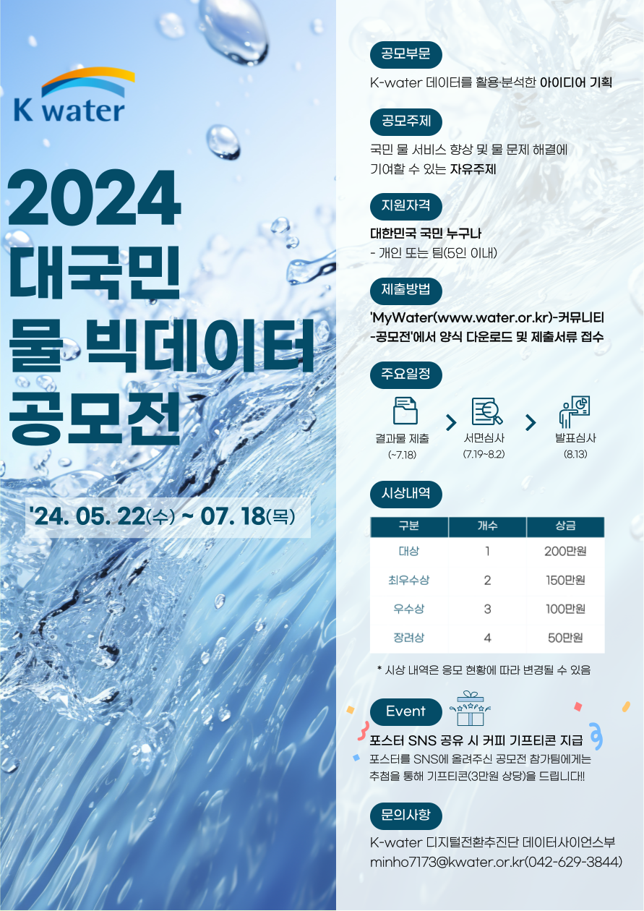
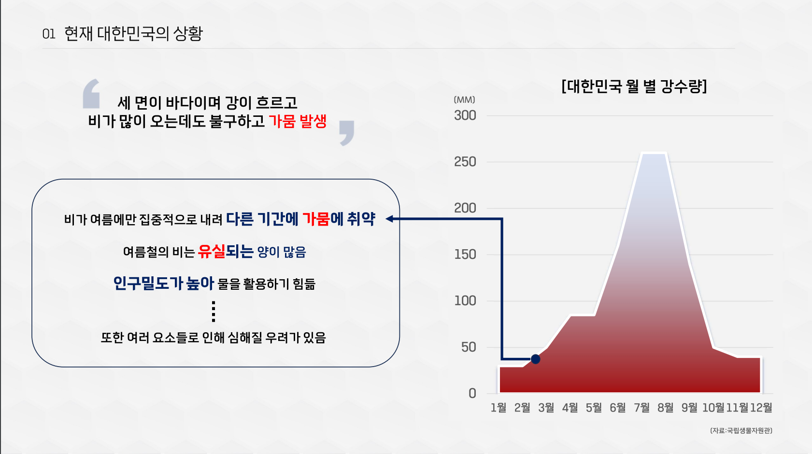
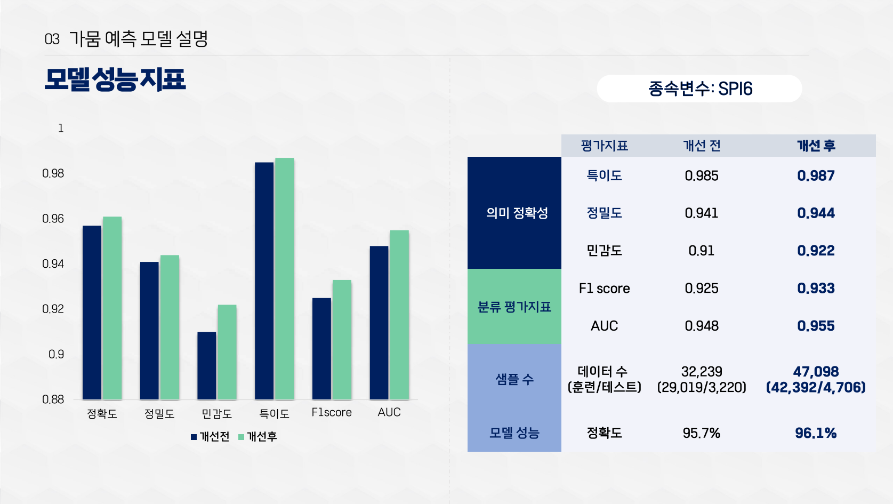
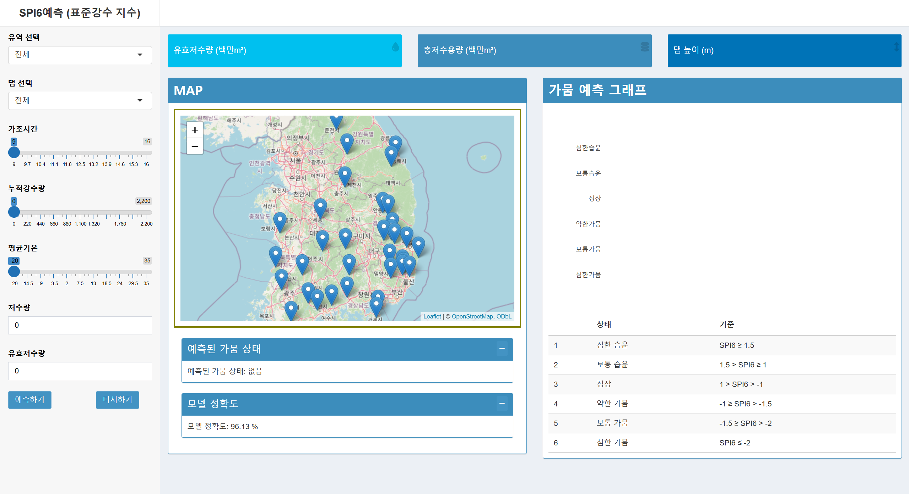

# 2024 대국민 물 빅데이터 공모전

### 📅 개발 기간: 2024.06.24 ~ 2024.07.18

### 🌟 프로젝트 소개
- **프로젝트 명:** 머신러닝 모델을 활용해 가뭄을 예측하는 프로젝트
- - **프로젝트 제작 인원:** 5명

- **주요 역할:**  
  - 댐 데이터를 전처리하여 예측 모델 개발  
  - **R Shiny**를 활용한 대시보드 설계 및 시각화 구현

- **개발 목표:**  
  - SPI6 데이터를 활용하여 가뭄 예측 시스템 개발  
  - **R Shiny**를 활용한 대시보드 제작 
 
- **성과:**    
  - 창의적 접근으로 **2024 대국민 물 빅데이터 공모전**에서 **장려상 수상**

---

#### 0. 공모전 포스터
- 아래는 **2024 대국민 물 빅데이터 공모전**을 위한 공식 포스터입니다.

### 🌟 프로젝트 이미지
- 아래는 프로젝트 발표 자료에서 사용된 대표 슬라이드입니다.

<table align="center">
  <tr>
    <td align="center">
      
      
수자원 공모전 메인 슬라이드 

    </td>
    <td align="center">
      
      
상황 분석

    </td>
    <td align="center">
      
      
모델 성능 지표

    </td>
  </tr>
</table>

#### 1. 발표 자료
- 아래는 공모전에서 사용된 **최종 발표 자료**입니다.  
  [K-water 최종 공모전 피피티.pdf](./K_water%20최종%20공모전%20피피티.pdf)
---

### 🛠 주요 기술 및 도구
- **데이터 전처리:** R, Oracle  
- **대시보드 개발:** R Shiny  

---

### 🔗 프로젝트 제작 R shiny 홈페이지 링크

- **프로젝트 URL:** [R Shiny 대시보드](https://spi-predictor.shinyapps.io/spi100/)

---

### 📄 프로젝트 상세 설명
- **데이터 전처리**:
  - 댐 데이터를 수집하여 SPI6 기반의 가뭄 예측 모델을 개발
- **대시보드 구현**:
  - **R Shiny**를 활용하여 직관적인 예측 결과를 제공하는 대시보드 설계
- **발표 및 성과**:
  - 공모전에서 창의적 접근과 뛰어난 시각화로 **장려상을 수상**
